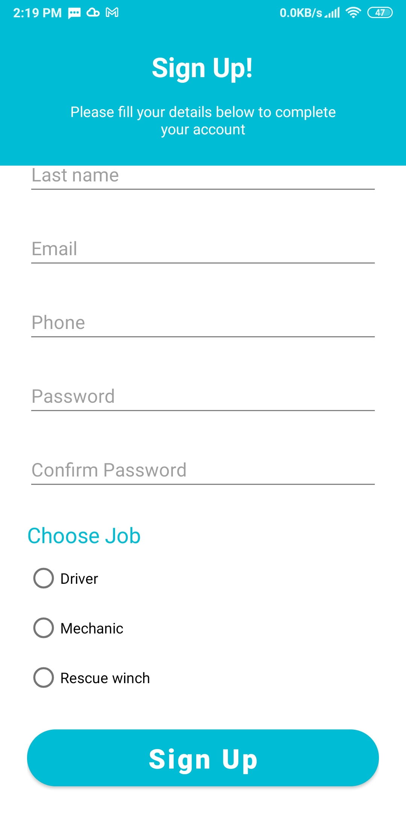
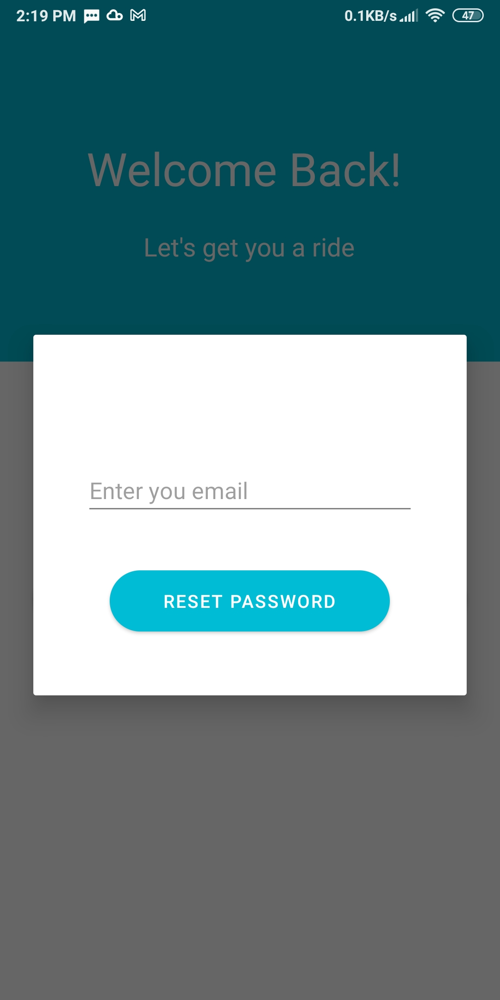
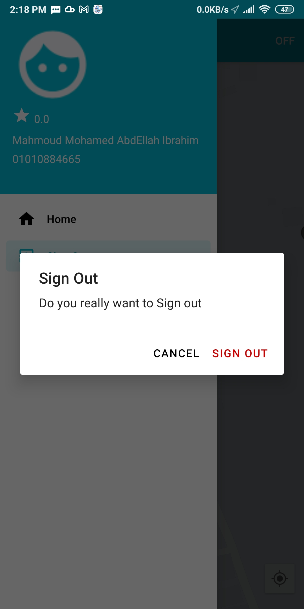
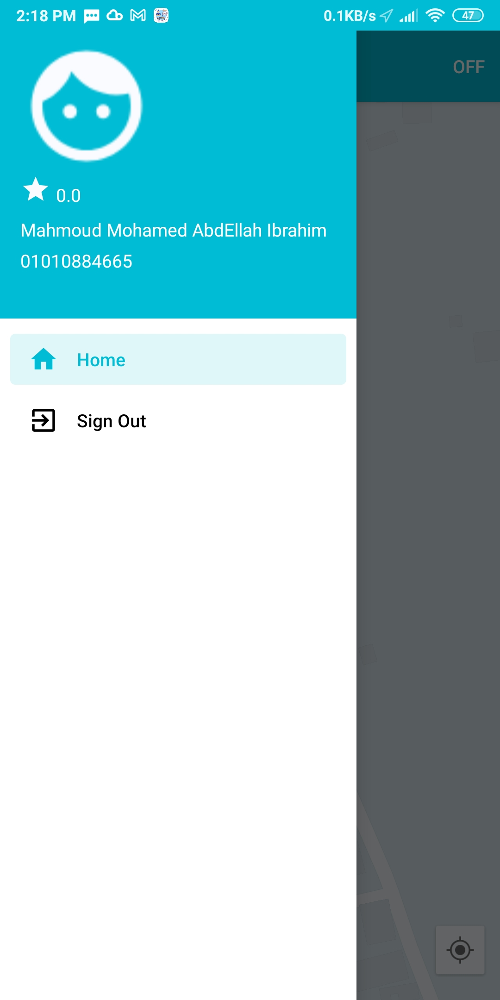
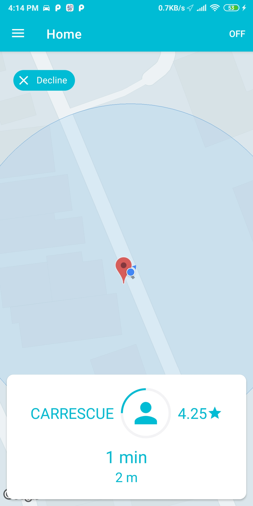
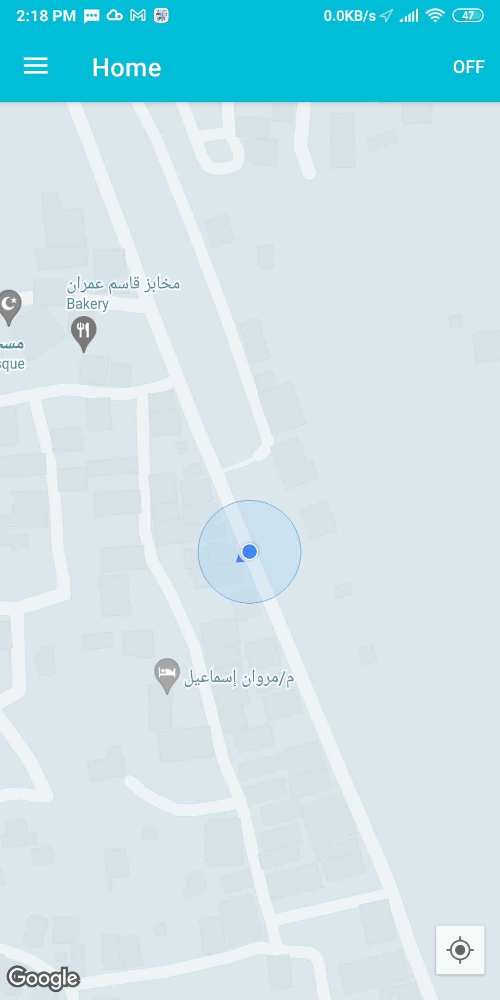
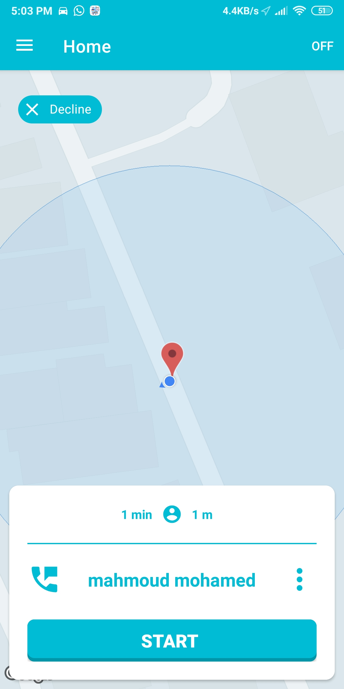
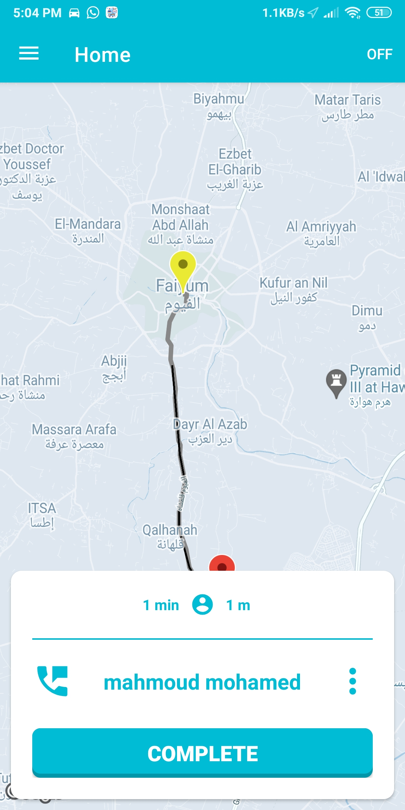

# GoogleMaps(DriverCarRescue)
 ## Screenshots
   
   <table>
  <tr>
    <td></td>
    <td></td>
  <td></td>
       <td></td>
  </tr>
 </table>

<table>
  <tr>
   <td></td>
 <td></td>
    <td></td>
    <td></td>
   
  </tr>
  </table>
  <table>
  <tr>
   <td></td>
 
    
   
  </tr>
  </table>

